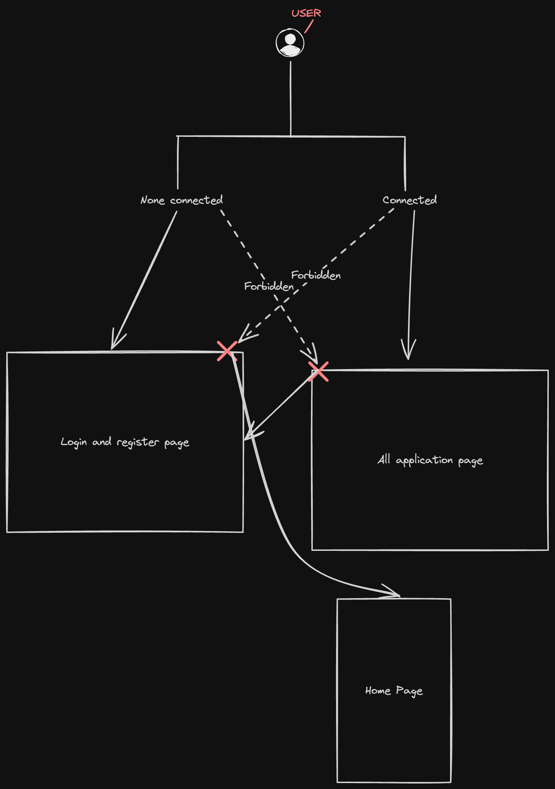

# HappyFit: Your Personalized Fitness Journey

Welcome to HappyFit! This project combines the power of Artificial Intelligence (AI) with the motivation of personalized fitness training to create an interactive web application experience. Whether you're a fitness enthusiast or a complete beginner in your health and wellness journey, HappyFit is designed to meet you exactly where you are.
Concept


At its core, HappyFit is your fitness partner. After entering your personal data and metrics, our intelligent system crafts a customizable weekly workout program tailored just for you. This is not a one-size-fits-all solution, but a personalized, thoughtful approach to fitness that adjusts dynamically with your unique body and needs.
Each program includes a variety of exercises complete with thorough explanations and helpful images to demonstrate proper execution. All details, such as the number of sets, repetitions, and other relevant notes are clearly specified. Our goal is to offer a system that adapts to you, not the other way around.
Project Status

- Please note: **HappyFit is currently a work-in-progress**. The journey so far has been incredible, but at this time, the project is paused. As much as I'm passionate about advancing this project, its continuation depends on a number of factors, and currently, I'm unable to specify an exact timeline for its resumption. But stay tuned, we'll make sure to update you all once we're back in action!


## Tech Stack
For those interested in the tech aspect of HappyFit, here are some technical details:
- Languages: The project is written entirely in Typescript.
- Frontend: We use Next.js for handling the frontend.
- Backend: For the backend operations, we use Nest.js.
- Database: Firebase acts as our database solution.
- Styling: Tailwind is utilized for UI needs.
- AI Model: To provide the personalized workout recommendations, we use OpenAI's API.

This is a big vision, and every single contribution matters. Your suggestions, feedback, and contributions are always welcomed and much appreciated.
HappyFit - because your fitness journey should make you happy! 🏋️‍♀️🏃‍♀️🧘‍♂️🏊‍♀️🚴‍♂️

## Getting Started

To start the project you need : 
- Node.js (>18)
- pnpm
- git
- A brain 

First, install the dependencies:

```bash
pnpm install
```

Then, run the development server:

```bash
pnpm run dev
```

Open [http://localhost:3000](http://localhost:3000) with your browser to see the result.

## Documentation

### Auth Guard
- The AuthGuard is a Higher Order Component (HOC) that wraps the pages that require authentication and do some actions depending on the authentication state. Look at the schema below to understand how it works.
  
- If the user have an accessToken in his locale storage (soon we'll move secured cookie) we do a verification on the server side to check if the token is valid. If it's not valid we redirect the user to the login page. There is 3 cases :
  - *Invalid Token* -> Redirect to login page
  - *Valid Token* -> User is authenticated
  - *Expired Token* -> Refresh the token with refresh Token
